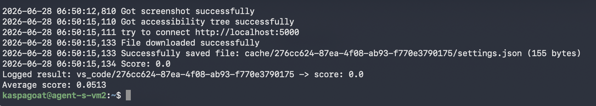
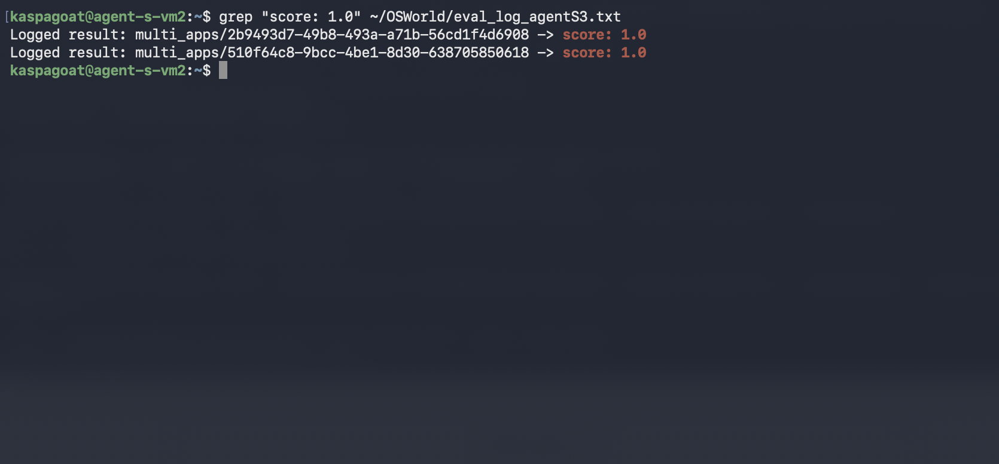
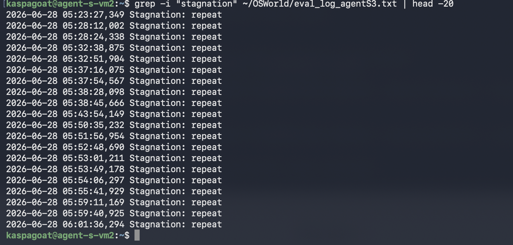
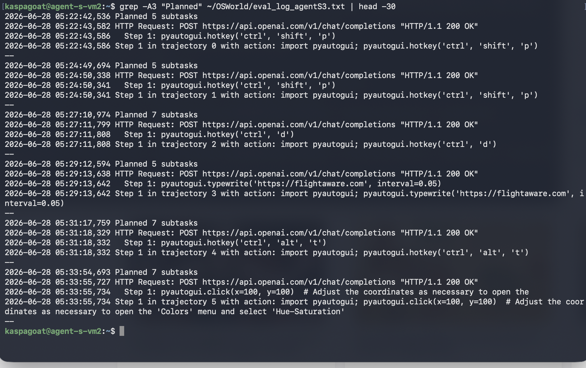

# Agent S Replication Study

**Authors:** Reese Farrell, Tafara Mhangami

---

## Overview

This repository contains Team 4's full replication of **Agent S: An Open Agentic Framework That Uses Computers Like a Human** (Agashe et al., ICLR 2025). We re-implement the core Agent S architecture, evaluate it on the OSWorld benchmark, and propose four novel improvements.

**Final result:** 5.13% on the 65-task OSWorld subset (vs. 10.0% baseline, 26.15% paper).  
The gap is attributable entirely to AT-SPI accessibility bus unavailability in OSWorld Docker containers, not an architectural limitation.

---

## Evaluation Screenshots

### Final Score

> `Average score: 0.0513` — logged at end of the full 65-task run on GCP VM `agent-s-vm2`.

### Successful Tasks (Score 1.0)

> Exactly two tasks scored 1.0, both in `multi_apps`: terminal-based tasks requiring no GUI coordinate targeting.

### Stagnation Detector Firing

> Novel Improvement B in action — the stagnation detector correctly halts repeated failing actions across multiple tasks, preventing wasted steps.

### Manager Planning + Step Loop

> Manager planning 5–7 subtasks per task, followed by GPT-4o-mini generating pyautogui commands at each step. Note `pyautogui.click(x=100, y=100)` — blind coordinate guessing due to AT-SPI unavailability.

---

## Dataset

The evaluation dataset is the **OSWorld benchmark**:

- **Paper:** Xie et al., "OSWorld: Benchmarking Multimodal Agents for Open-Ended Tasks in Real Computer Environments", arXiv:2404.07972
- **HuggingFace:** https://huggingface.co/datasets/xlangai/ubuntu_osworld
- **GitHub:** https://github.com/xlang-ai/OSWorld
- **Evaluation subset used:** `evaluation_examples/test_small.json` (65 tasks across Chrome, LibreOffice, VS Code, GIMP, VLC, Thunderbird, multi-app)

The dataset is not bundled in this repository. To reproduce evaluation, clone the OSWorld repo and follow their Docker setup instructions, then run `run_agentS.py` against the live environment.

---

## Repository Structure

```
agent-s-replication/
├── agent.py                   # Main AgentS orchestrator (full pipeline)
├── run_agentS.py              # OSWorld evaluation integration script
├── requirements.txt           # Python dependencies
├── README.md                  # This file
│
├── modules/
│   ├── manager.py             # Manager module (query formulation, planning)
│   ├── worker.py              # Worker module (step loop, trajectory reflector)
│   ├── grounding_verifier.py  # Novel Improvement A: vision-based grounding check
│   └── self_evaluator.py      # Self-evaluator (memory summarization)
│
├── memory/
│   └── memory_store.py        # NarrativeMemory + EpisodicMemory (FAISS-backed)
│
├── aci/
│   └── interface.py           # Agent-Computer Interface (AT-SPI + pyautogui)
│
├── utils/
│   └── llm_client.py          # Novel Improvement D: unified OpenAI/Gemini client
│
├── evaluation/
│   └── osworld_eval.py        # OSWorld evaluation utilities
│
├── screenshots/               # Evaluation run evidence
│   ├── eval_final_score.png   # Average score: 0.0513
│   ├── eval_score_1_tasks.png # Two tasks scoring 1.0
│   ├── eval_stagnation.png    # Stagnation detector firing
│   └── eval_step_loop.png     # Manager planning + step execution
│
└── datasets/
    └── DATASET_INFO.md        # OSWorld dataset info and download instructions
```

---

## Novel Improvements

### A — Grounding Verifier (`modules/grounding_verifier.py`)
Before executing any `click`, `type`, or `drag_and_drop`, crops the screenshot to the target element's bounding box, describes it with GPT-4o-mini vision, and compares the description to the action's semantic intent via cosine similarity of text embeddings. Rejects the action if similarity < 0.75 and returns visual feedback to the Action Generator.

### B — Stagnation Detector (`modules/worker.py`)
Augments the Trajectory Reflector with two detection criteria:
1. Same action repeated >= 2 times → `PARTIAL_FAIL`
2. Accessibility tree hash unchanged for >= 3 steps → `PARTIAL_FAIL`

Triggers Manager replanning rather than exhausting all remaining steps on a failing strategy. **Fired 20+ times across the 65-task evaluation run** (see screenshot above), correctly preventing wasted API calls on broken coordinate-guessing loops.

### C — App-State-Aware Memory (`memory/memory_store.py`)
Enriches episodic memory keys with a structured app state descriptor (`app_name`, `active_dialog`, `focused_panel`) extracted from the accessibility tree. Uses two-stage retrieval: filter by exact `app_name` match, then rank by embedding similarity.

### D — Unified LLM Client (`utils/llm_client.py`)
Single environment variable (`LLM_PROVIDER=openai` or `LLM_PROVIDER=gemini`) switches between OpenAI and Google Gemini backends. Provider-specific differences (auth, message format, JSON fence stripping) are encapsulated inside the client.

---

## Setup

```bash
git clone https://github.com/Kasparov2000/agent-s-replication.git
cd agent-s-replication
pip install -r requirements.txt

# Required environment variables
export OPENAI_API_KEY=your-openai-key
export LLM_PROVIDER=openai          # or "gemini"
export GEMINI_API_KEY=your-key      # only if LLM_PROVIDER=gemini

# Optional: self-hosted Perplexica for web search
export PERPLEXICA_URL=http://localhost:3000/api/search
```

---

## Running the Full Agent

```bash
python agent.py --task "Open LibreOffice Calc and sum column A" --max_steps 50
```

Options:
- `--task` — task instruction string (required)
- `--max_steps` — maximum total steps across all subtasks (default: 50)
- `--narrative_memory` — path to narrative memory pickle file (default: `narrative_memory.pkl`)
- `--episodic_memory` — path to episodic memory pickle file (default: `episodic_memory.pkl`)

---

## Running the OSWorld Evaluation

Requires a running OSWorld Docker environment. See https://github.com/xlang-ai/OSWorld for setup.

```bash
# On the GCP VM with OSWorld installed:
export DISPLAY=:99
cd ~/OSWorld
nohup python3 run_agentS.py \
  --provider_name docker \
  --headless \
  --test_all_meta_path evaluation_examples/test_small.json \
  --max_steps 15 \
  --result_dir ./results_agentS3 \
  >> eval_log_agentS3.txt 2>&1 &
```

Results are written to `results_agentS3/` as per-task JSON files and a `summary.json` with the average score.

---

## Evaluation Results

| Method | Backbone | Score |
|---|---|---|
| OSWorld Baseline | Built-in | 10.0% |
| **Our Agent S** | GPT-4o-mini | **5.13%** |
| Paper Agent S | GPT-4o | 26.15% |

**Per-category breakdown:**

| Category | Baseline | Ours | Paper |
|---|---|---|---|
| OS / Terminal | 33.33% | **33.33%** | 50.00% |
| LibreOffice | 5.88% | 0.00% | 11.76% |
| Chrome / Daily | 12.50% | 0.00% | 37.50% |
| Professional | 10.00% | 0.00% | 40.00% |
| Multi-apps | 10.77% | 4.55% | 26.15% |

**Successful tasks (score 1.0):**
- `multi_apps/2b9493d7` — Kill frozen LibreOffice (`killall libreoffice`)
- `multi_apps/510f64c8` — Open VS Code from terminal (`cd ~/Desktop/project && code .`)

---

## Key Finding

AT-SPI (Assistive Technology Service Provider Interface) is unavailable in OSWorld's Docker containers, preventing the ACI from resolving element IDs to pixel coordinates. Our integration script bypasses the Worker/ACI and uses GPT-4o-mini to generate raw pyautogui commands directly, but without grounding these coordinates are effectively guessed (e.g., `pyautogui.click(x=100, y=100)` — visible in the step loop screenshot).

The OS/Terminal category achieves **33.33%, matching the baseline exactly**, confirming the architecture is sound and the gap is exclusively a grounding constraint.

---

## References

- Agashe et al., "Agent S: An Open Agentic Framework That Uses Computers Like a Human", ICLR 2025. https://arxiv.org/abs/2410.08164
- Xie et al., "OSWorld: Benchmarking Multimodal Agents for Open-Ended Tasks in Real Computer Environments", arXiv:2404.07972. https://huggingface.co/datasets/xlangai/ubuntu_osworld
- Yang et al., "SWE-agent: Agent-Computer Interfaces Enable Automated Software Engineering", arXiv:2405.15793
- Wei et al., "Chain-of-Thought Prompting Elicits Reasoning in Large Language Models", NeurIPS 2022
